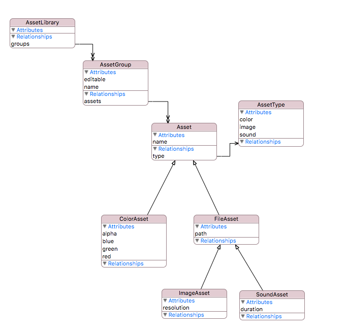

#Protocols

## Creating protocols
You can create protocols in the data model designer.
You  create protocols by specifying the `State.Protocol` key or checking the abstract checkbox in the inspector for the entity to be a protocol. 

### Function requirements
You can specify function requirements on protocols using the `State.ProtocolRequirementType` and the `State.Func` key on the protocol entities attributes. 
**Note:** an empty implementation is added to the **manual** file only the first time it is generated. If you already generated code before adding this requirement
you may have to manually add it to the manual file.

### Get only variable requirements
You can specify a variable requirement as get only using the `State.ProtocolRequirementType` with a value of `get` on protocol attributes and relashionships.
**Note:** an empty implementation is added to the **manual** file only the first time it is generated. If you already generated code before adding this requirement
you may have to manually add it to the manual file.

###Inherit from other protocols 
There are two ways you can specify a protocol inherits from other protocols. 

1. Set one protocol entity as the parent of another protocol entity
2. Use the `State.Type` key on a protocol entity to specify additional protocols. These are entered as a comma seperated list. For example if you want your protocol
to also inherit from `CustomStringConvertible` and `CustomDebugStringConvertible` you would enter `CustomStringConvertible, CustomStringConvertible` as the value for 
`State.Type` on the protocol entity.

##Conforming to protocol
To specify a model item has conformance to a protocol, set the protocol as the parent entity of a model item. 

**Note:** You do not need to re-specify the protocols requirements in your conforming entity, they will be inherited and implemented automatically.

## Using protocols

You can use protocols as types just like struct and enum types. A protocol extension is started for you in the manual file so you can extend your protocol if needed.

You can compose with protocols. For example, one model item can have a one to many composition to a protocol type. This allows you to add any conforming type into the composition collection of the containing model type. 

### Example:
The following shows a valid model design for an AssetLibrary. AssetGroup has assets which is a one-to-many relationship to the `Asset protocol type`. `FileAsset` is protocol that inherits from `Asset`. ColorAsset, ImageAsset, and SoundAsset are all conforming model types.

You can add any of the conforming types to the assets of `AssetGroup`. When AssetGroup is serialized and de-serialized, each type contained in the assets composition will be restored.

Notes:
* Protocols can inherit from other protocols
* Protocol requirements can include other model items
* Model items can have relationships to protocol types.
