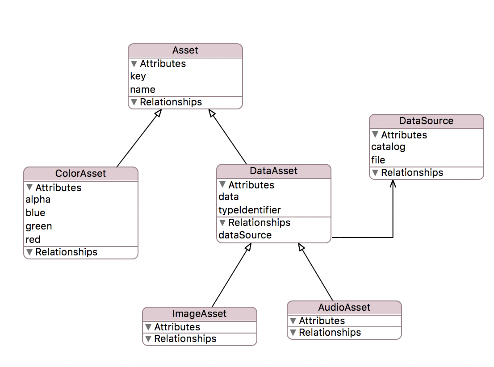

# State 

State is a Swift model framework that supports struct, enum, and protocol models which can be stored as plist, json, or binary files. State provides a set of custom mogenerator code templates allowing models to be designed in the Xcode data modeler, and automatic code generation using mogenerator.

## Key features: 
- Struct models
- Enum models (including case, raw value, and associated value types including other models)
- Protocol models (including protocol inheritance)
- One-to-one, or one-to-many relationships between models
- Version and migration
- Automatic code generation from an Xcode data model


## 

**Requirements**
- Swift 3.0
- Xcode 8.0
- iOS 8.0
- Mogenerator 1.28

## Automatic Code Generation Samples

- Associated Enums: [_testAssociatedEnum.swift](https://github.com/amberstar/State/blob/master/Tests/StateTests/Models/_TestAssociatedEnum.swift)
- Protocols: [_TestProtocolConformer.swift](https://github.com/amberstar/State/blob/master/Tests/StateTests/Models/_TestProtocolConformer.swift)
- Collections: [_TestCollections.swift](https://github.com/amberstar/State/blob/master/Tests/StateTests/Models/_TestCollections.swift)
- A model inside a dictionary of another model: [_TestDictionaryComposition.swift](https://github.com/amberstar/State/blob/master/Tests/StateTests/Models/_TestDictionaryComposition.swift)
- [And many more (see files at the bottom with underscores):](https://github.com/amberstar/State/tree/master/Tests/StateTests/Models)

### See the [Data Modeler-Code Generation Docs](https://github.com/amberstar/State/blob/master/CodegenGuide.md) for more information.

## Sample Model:
This model was designed in the Xcode data modeler and code was generated automatically.


```swift
//
// AUTO GENERATED FILE
// _ColorAsset.swift
//

import Foundation
import State

public struct ColorAsset : Asset  {
    public var green: Float
    public var key: String?
    public var red: Float
    public var name: String
    public var alpha: Float
    public var blue: Float

}

extension ColorAsset  {

    public init?(with source: Store) {
        let store = ColorAsset.migrate(source: source)

         guard
            let green: Float = store.value(forKey: "green"),
            let red: Float = store.value(forKey: "red"),
            let name: String = store.value(forKey: "name"),
            let alpha: Float = store.value(forKey: "alpha"),
            let blue: Float = store.value(forKey: "blue")
         else { return  nil }

        let key: String? = store.value(forKey: "key")

        self.green = green
        self.key = key
        self.red = red
        self.name = name
        self.alpha = alpha
        self.blue = blue
        finishReading(from: store)
    }

// MARK: - Storeable

    public static func restore(from store: Store) -> ColorAsset? {
        return self.init(with: store)
    }

    public func store(to store: inout Store) {
        store.set(green, forKey: "green")
        store.set(key, forKey: "key")
        store.set(red, forKey: "red")
        store.set(name, forKey: "name")
        store.set(alpha, forKey: "alpha")
        store.set(blue, forKey: "blue")

        store.set("ColorAsset", forKey: "Asset")
        ColorAsset.writeVersion(to: &store)
        finishWriting(to: &store)
    }
}
```


## Reading and Writing Models

Models, and collections of models can be
  written to and read from files, `Strings`, or `Data`.

```swift
// write employee to a JSON file
employee.write(to: fileURL, format: .json) // .json, .plist, .binary support

// convert to a JSON string
var jsonString = employee.makeJson()

// convert to `Data`
var data: Data = employee.makeData()

// read employee from a JSON file
let employee = Employee(jsonFile: fileURL) // plistFile, binaryFile api also
```

## Versioning and Migration
Versioning and migration is opt-in. Models do not version or migrate by default.

To support versioning and migration implement the following methods in your model extension:

  * `static func writeVersion(with: inout Store)`

     This method is called before writing a model is finished to give the model an
     opportunity to write version information to the store.

  * `static func migrate(from: Store) -> Store`

     This method is called before reading a model to give the model
     an opportunity to migrate the store. In this method:

    -  read the version information from the store
    -  compare the version information with the "current version"
    -  add, remove, and update keys, and values in the store as necessary
    -  return the updated store

## Adding State framework to your project.

### Carthage

[Carthage]: https://github.com/Carthage/Carthage

Add the following to your project's Cartfile:

```
github "STLabs/State" ~> 0.1
```

Then run `carthage update`.

Follow the current instructions in [Carthage's README][carthage-installation]
for up to date installation instructions.

### Using Submodules
1. Add State as a submodule by going to your project directory and enter the following:
`git submodule add https://github.com/STLabs/State.git`
2. Open the State folder and drag and drop the State.xcodeproj into the file navigator of your workspace.

3. In Xcode, select the project icon to opefn the target window and select your host target that will use State.

4. Select the "Build Phases" tab in the target configuration window.

5. Add State as a target dependency to the host target

6. Click on the + button at the top left and select "New Copy Files Phase". Rename this new phase to "Copy Frameworks", set the "Destination" to "Frameworks", and add State.framework.

[carthage-installation]: https://github.com/Carthage/Carthage#adding-frameworks-to-an-application


